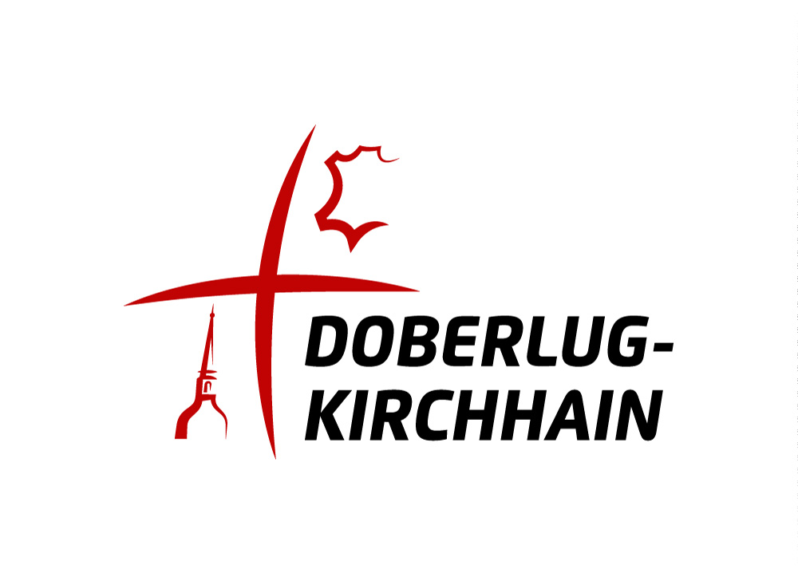

# Protokollierungsassistenz

Webanwendung zur automatischen Transkription, Sprechererkennung, TOP-Zuordnung,
Zusammenfassung und Protokollerstellung aus Audioaufnahmen kommunaler Sitzungen.

Dieses Repository ist ein weiterentwickelter Fork der ursprünglichen
Protokollierungsassistenz. Die Weiterentwicklung erfolgte durch
**Keule-Services**, **Erik Benke** und die **Stadt Doberlug-Kirchhain**.

<p align="center">
  
  &nbsp;&nbsp;&nbsp;&nbsp;
  
</p>

## Was ist neu in diesem Fork?

- End-to-End-Pipeline vom Audio-Upload bis zur prüfbaren Protokollvorlage
- automatische Sprecherdiarisierung mit lokalen Sprecherprofilen
- automatische Sprecher-Wiedererkennung mit Opt-in, Profilvorschlägen und manueller Bestätigung
- Verwaltung gespeicherter Sprecherprofile inklusive Umbenennen, Archivieren und Löschen gespeicherter Embeddings
- automatische TOP-Erkennung und Segmentierung aus Transkript und optionaler PDF-Einladung
- PDF-Upload zur Extraktion von Tagesordnungspunkten
- Review-Oberfläche für unsichere TOP-Grenzen, Sprecherzuordnungen und Zusammenfassungen
- editierbares Transkript mit Zusammenführen/Splitten von Zeilen und Segmenten
- sitzungsübergreifende Persistenz in SQLite inklusive Sitzungswiederherstellung
- Export als DOCX, PDF oder TXT mit Metadaten, Sprecherliste, Transkript-Auszug und Generierungshinweis
- lokales Docker-Setup mit CPU- oder optionalem NVIDIA-GPU-Betrieb

Die bisherigen Screenshots wurden entfernt, weil sie den aktuellen Stand der
Anwendung nicht mehr abbilden.

## Typischer Ablauf

1. Audioaufnahme hochladen.
2. Optional PDF-Einladung hochladen oder TOPs manuell eingeben.
3. Optional "Sprecher dauerhaft merken" aktivieren, wenn Sprecherprofile für künftige Sitzungen genutzt werden sollen.
4. "Automatisch verarbeiten" starten.
5. Erkannte TOP-Segmente, Sprecher und unsichere Stellen prüfen und bei Bedarf korrigieren.
6. Zusammenfassungen je TOP prüfen, neu generieren oder bearbeiten.
7. Protokoll mit Sitzungsmetadaten als DOCX, PDF oder TXT exportieren.

Wenn keine TOPs angegeben werden, kann die Anwendung ein gesamtes Gespräch als
einen Gesamt-TOP zusammenfassen.

## Systemanforderungen

| Anforderung | Minimum | Empfohlen |
| --- | --- | --- |
| Betriebssystem | Windows 10/11, macOS 11+, Linux | Windows/Linux für GPU |
| Docker | Docker Desktop oder Docker Engine mit Compose | aktuelle Docker-Version |
| RAM | 8 GB | 16 GB oder mehr |
| Speicherplatz | 25 GB | 40 GB oder mehr |
| Internet | für Installation, Images und Modell-Downloads | stabile Verbindung |
| GPU | optional | NVIDIA-GPU mit Container Toolkit |

Für die lokale Transkription nutzt das Backend WhisperX und PyAnnote. Wenn die
Modelle nicht im Docker-Image vorinstalliert sind, wird für die PyAnnote-
Diarisierung ein HuggingFace-Token über `HF_TOKEN` benötigt.

## Installation

### 1. Repository beziehen

```bash
git clone https://github.com/Schlafhormon/ki-protokollierung.git
cd ki-protokollierung
```

Alternativ kann das Repository als ZIP von GitHub heruntergeladen und entpackt
werden.

### 2. Docker installieren und starten

Installieren Sie Docker Desktop bzw. Docker Engine mit Docker Compose:

- Windows: https://docs.docker.com/desktop/install/windows-install/
- macOS: https://docs.docker.com/desktop/install/mac-install/
- Linux: https://docs.docker.com/desktop/install/linux-install/

Starten Sie Docker, bevor Sie das Setup ausführen.

### 3. Optional `.env` anlegen

Für viele lokale Tests reichen die Standardwerte. Wenn Sie lokale Images ohne
vorinstallierte Modelle verwenden, setzen Sie für die Sprecherdiarisierung einen
HuggingFace-Token:

```bash
cp .env.example .env
# In .env setzen:
# HF_TOKEN=hf_...
```

Unter PowerShell:

```powershell
Copy-Item .env.example .env
# Danach .env bearbeiten und HF_TOKEN setzen, falls erforderlich.
```

### 4. Setup starten

Windows:

```powershell
.\setup.ps1
```

macOS/Linux:

```bash
chmod +x ./setup.sh
./setup.sh
```

Das Setup prüft Docker, erkennt optional eine NVIDIA-GPU, baut in diesem Fork bei
einem lokalen Repository standardmäßig lokale Docker-Images und startet
Frontend, Backend und Ollama per Docker Compose.

Nach erfolgreichem Start ist die Anwendung erreichbar unter:

```text
http://localhost:3000
```

## Setup-Befehle

| Befehl | Windows | macOS/Linux |
| --- | --- | --- |
| Starten/Fortsetzen | `.\setup.ps1` | `./setup.sh` |
| Stoppen | `.\setup.ps1 stop` | `./setup.sh stop` |
| Status prüfen | `.\setup.ps1 status` | `./setup.sh status` |
| Neustart | `.\setup.ps1 restart` | `./setup.sh restart` |
| Logs anzeigen | `.\setup.ps1 logs` | `./setup.sh logs` |
| Daten löschen und neu starten | `.\setup.ps1 cleanup` | `./setup.sh cleanup` |

Wichtige Setup-Variablen:

| Variable | Bedeutung | Standard |
| --- | --- | --- |
| `PROTOKOLL_BUILD_LOCAL` | lokale Images aus diesem Repository bauen (`auto`, `true`, `false`) | `auto` |
| `PROTOKOLL_PRECACHE_MODELS` | ML-Modelle beim lokalen Build vorladen | `0` |
| `PROTOKOLL_BUILD_NO_CACHE` | Docker-Build ohne Cache erzwingen | `false` |
| `PROTOKOLL_IMAGE_TAG` | veröffentlichte App-Images auf einen Release-Tag pinnen | leer |
| `PROTOKOLL_PULL_POLICY` | Pull-Verhalten für Images (`missing`, `always`, `never`) | `missing` |
| `FRONTEND_IMAGE`, `BACKEND_IMAGE`, `BACKEND_GPU_IMAGE` | explizite Image-Referenzen verwenden | leer |

Wenn `PROTOKOLL_IMAGE_TAG` oder explizite Image-Variablen gesetzt sind, nutzt
das Setup diese Images statt automatisch lokale Images zu bauen.

## Datenschutz und Sprecherprofile

Die Anwendung verarbeitet Audio, Transkripte, TOPs, Zusammenfassungen und
Sprecherinformationen lokal in der Docker-Umgebung. Persistente Daten liegen in:

- `./data/sessions.sqlite3` für Sitzungen, Jobs, TOPs, Zuordnungen, Sprecherprofile und Export-Metadaten
- `./uploads` für gespeicherte Audiodateien zur Wiedergabe und Sitzungswiederherstellung
- Docker-Volume `ollama_data` für lokale Ollama-Modelle

Das dauerhafte Merken von Sprechern ist standardmäßig ausgeschaltet. Ohne Opt-in
werden keine globalen Sprecherprofile vorgeschlagen oder automatisch dauerhaft
gespeichert. Lokale Sprecher können weiterhin nur für die aktuelle Sitzung
benannt werden.

Dauerhafte Sprecherprofile und globale Embeddings entstehen erst nach einer
ausdrücklichen Aktion, zum Beispiel:

- "Sprecher dauerhaft merken" aktivieren
- "Vorschlag übernehmen"
- "Neues Profil merken"
- "Bestehendem Profil zuordnen"

In der Sprecherprüfung können Profile umbenannt, archiviert und gespeicherte
Embeddings gelöscht werden. Archivierte Profile werden standardmäßig nicht mehr
für Vorschläge verwendet.

## Konfiguration

Die wichtigsten Laufzeitvariablen können in `.env` gesetzt werden.

| Variable | Beschreibung | Standard |
| --- | --- | --- |
| `HF_TOKEN` | HuggingFace-Token für PyAnnote, wenn Modelle nicht vorinstalliert sind | leer |
| `WHISPER_MODEL` | Whisper-Modell | `large-v2` |
| `WHISPER_DEVICE` | Gerät für WhisperX (`cpu`, `cuda`, `auto`) | Compose: `cpu` |
| `WHISPER_BATCH_SIZE` | Batch-Größe für Transkription | `16` |
| `WHISPER_LANGUAGE` | Sprache | `de` |
| `LLM_BASE_URL` | OpenAI-kompatibler LLM-Endpunkt | Compose: `http://ollama:11434/v1`, lokale Backend-Entwicklung: `http://localhost:11434/v1` |
| `LLM_MODEL` | Modell für Zusammenfassungen und TOP-Extraktion | `qwen3:8b` |
| `LLM_TIMEOUT_SECONDS` | Timeout je LLM-Anfrage | `120` |
| `LLM_CHUNK_CHARS` | Chunk-Größe für lange TOP-Texte | `12000` |
| `SPEAKER_EMBEDDING_ENABLED` | lokale Sprecher-Embeddings für prüfbare Matches erzeugen | `true` |
| `SPEAKER_MATCH_AUTO_THRESHOLD` | Schwelle für starke Sprecherprofil-Matches | `0.82` |
| `SPEAKER_MATCH_SUGGEST_THRESHOLD` | Mindestschwelle für Vorschläge | `0.72` |
| `AGENDA_DETECTION_USE_LLM` | LLM für TOP-Erkennung ohne expliziten UI/API-Wunsch verwenden | `false` |
| `PERSISTENCE_DB_PATH` | SQLite-Pfad im Backend-Container | `/app/data/sessions.sqlite3` |
| `MAX_UPLOAD_BYTES` | maximale Uploadgröße | `524288000` |
| `TRANSCRIPTION_CONCURRENCY` | parallele Transkriptionsjobs | `1` |
| `PIPELINE_CONCURRENCY` | parallele End-to-End-Pipelinejobs | `1` |

Weitere Optionen stehen in `.env.example`. In Docker Compose sollte
`LLM_BASE_URL` normalerweise nicht gesetzt werden; der Backend-Container nutzt
dann automatisch den internen Ollama-Service. Ein `localhost`-Wert ist nur für
lokale Backend-Entwicklung außerhalb von Docker sinnvoll. Externe
OpenAI-kompatible Endpunkte müssen explizit mit vollständiger `/v1`-URL
konfiguriert werden.

## GPU-Modus

Für NVIDIA-GPUs unter Windows oder Linux:

1. NVIDIA-Treiber installieren.
2. NVIDIA Container Toolkit installieren.
3. Docker neu starten.
4. Setup ausführen und GPU-Modus auswählen, wenn das Skript danach fragt.

Der GPU-Override nutzt `docker-compose.gpu.yml` und setzt das Backend auf
`WHISPER_DEVICE=cuda`. macOS unterstützt diesen NVIDIA-GPU-Modus nicht.

## Fehlerbehebung

### Docker läuft nicht

Docker Desktop bzw. Docker Engine starten und das Setup erneut ausführen.

### Backend meldet fehlenden HuggingFace-Token

Wenn lokale Images ohne vorinstallierte Modelle gebaut wurden, setzen Sie in
`.env`:

```text
HF_TOKEN=hf_...
```

### Zusammenfassung meldet LLM-/Ollama-Fehler

Docker Compose startet einen internen Ollama-Dienst und lädt standardmäßig
`LLM_MODEL=qwen3:8b`. Prüfen Sie die LLM-Diagnose mit:

```bash
curl http://localhost:8010/api/llm/diagnostics
```

Wenn das Modell fehlt, laden Sie es nach:

```bash
docker compose exec ollama ollama pull qwen3:8b
```

Für lokale Backend-Entwicklung ohne Docker muss Ollama lokal laufen und
`LLM_BASE_URL=http://localhost:11434/v1` gesetzt sein.

Danach neu starten:

```bash
./setup.sh restart
```

oder unter Windows:

```powershell
.\setup.ps1 restart
```

### Anwendung ist langsam

- CPU-Transkription ist deutlich langsamer als GPU-Transkription.
- Der erste Lauf lädt Modelle und kann länger dauern.
- Docker sollte ausreichend RAM erhalten, empfohlen sind mindestens 8 GB.

### Logs ansehen

```bash
docker compose logs -f
```

oder über das Setup:

```bash
./setup.sh logs
```

### Cleanup

Das entfernt Container und Docker-Volumes, insbesondere heruntergeladene
Ollama-Modelle. Die lokalen Bind-Mounts `uploads/` und `data/` bleiben bestehen;
löschen Sie diese Ordner nur bewusst, wenn auch hochgeladene Dateien und
gespeicherte Sitzungen entfernt werden sollen.

```bash
./setup.sh cleanup
```

Windows:

```powershell
.\setup.ps1 cleanup
```

## Entwicklung

### Projektstruktur

```text
ki-protokollierung/
├── app/
│   ├── frontend/          React + TypeScript + Vite
│   └── backend/           FastAPI, WhisperX, PyAnnote, Export, Persistenz
├── scripts/               Hilfs- und Research-Skripte
├── k8s/                   Kubernetes-Manifeste
├── docker-compose.yml     lokale Compose-Umgebung
├── docker-compose.gpu.yml GPU-Override
├── setup.ps1              Windows-Setup
└── setup.sh               macOS/Linux-Setup
```

### Backend lokal

```bash
cd app/backend
uv sync
HF_TOKEN=hf_... uv run uvicorn main:app --port 8010
```

Das Backend läuft dann unter `http://localhost:8010`.

### Frontend lokal

```bash
cd app/frontend
npm install
npm run dev
```

Das Frontend läuft dann unter `http://localhost:5173`.

### Tests

Backend:

```bash
cd app/backend
uv run pytest
```

Frontend:

```bash
cd app/frontend
npm test
npm run typecheck
npm run lint
```

### Lokale Docker-Images bauen

CPU:

```bash
docker build --build-arg PRECACHE_MODELS=0 -t ki-protokollierung-backend:local ./app/backend
docker build -t ki-protokollierung-frontend:local ./app/frontend
```

GPU:

```bash
docker build -f app/backend/Dockerfile.gpu --build-arg PRECACHE_MODELS=0 -t ki-protokollierung-backend:gpu-local ./app/backend
```

Wenn Modelle im Image vorinstalliert werden sollen, `PRECACHE_MODELS=1` setzen
und `HF_TOKEN` als BuildKit-Secret bereitstellen.

## API-Auszug

| Endpoint | Methode | Zweck |
| --- | --- | --- |
| `/health` | GET | Healthcheck |
| `/api/pipeline/start` | POST | End-to-End-Verarbeitung starten |
| `/api/pipeline/{pipeline_id}` | GET | Pipeline-Status abrufen |
| `/api/pipeline/{pipeline_id}/cancel` | POST | Pipeline abbrechen |
| `/api/pipeline/{pipeline_id}/result` | GET | fertiges Review-Ergebnis laden |
| `/api/sessions` | POST | Sitzung speichern/anlegen |
| `/api/sessions/{session_id}` | GET/PUT | Sitzung laden/speichern |
| `/api/transcribe` | POST | Legacy-Transkriptionsjob starten |
| `/api/audio/{job_id}` | GET | Audiodatei streamen |
| `/api/extract-tops` | POST | TOPs aus PDF extrahieren |
| `/api/agenda-detection` | POST | TOPs und Segmentgrenzen erkennen |
| `/api/summarize` | POST | Zusammenfassung erzeugen |
| `/api/llm/diagnostics` | GET | LLM-Endpunkt und Modell prüfen |
| `/api/export` | POST | Protokoll als TXT, DOCX oder PDF exportieren |
| `/api/speaker-profiles` | GET/POST | Sprecherprofile listen/anlegen |
| `/api/speaker-profiles/{profile_id}` | PUT/DELETE | Profil ändern oder archivieren |
| `/api/speaker-profiles/{profile_id}/embeddings` | DELETE | gespeicherte Embeddings löschen |
| `/api/sessions/{session_id}/speaker-observations` | GET | Sprecherprofil-Vorschläge abrufen |

## Kubernetes

Unter `k8s/` liegen Manifeste für ein GPU-beschleunigtes Deployment. Die
Kubernetes-Variante nutzt standardmäßig eine externe OpenAI-kompatible LLM-API
statt des lokalen Ollama-Containers. Details stehen in `k8s/README.md`.

## Ursprung und Förderung

Die ursprüngliche Protokollierungsassistenz entstand im Umfeld des AI Service
Centre Berlin Brandenburg. Dieses Repository enthält die darauf aufbauende
Weiterentwicklung durch Keule-Services, Erik Benke und die Stadt
Doberlug-Kirchhain.

<p>
  <a href="http://hpi.de/kisz">
    
  </a>
  &nbsp;&nbsp;
  
</p>

Das AI Service Centre Berlin Brandenburg wird durch das Bundesministerium für
Forschung, Technologie und Raumfahrt unter dem Förderkennzeichen 16IS22092
gefördert.
